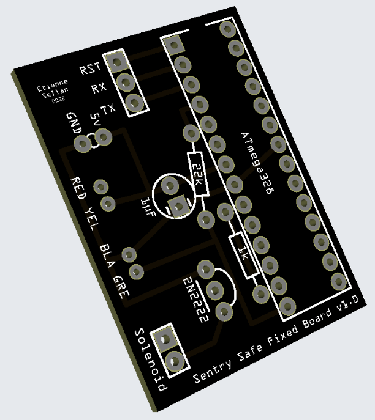
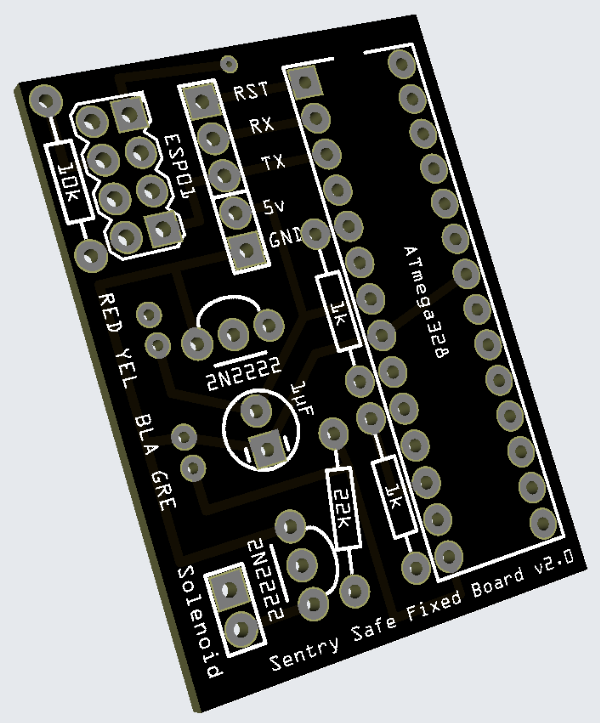
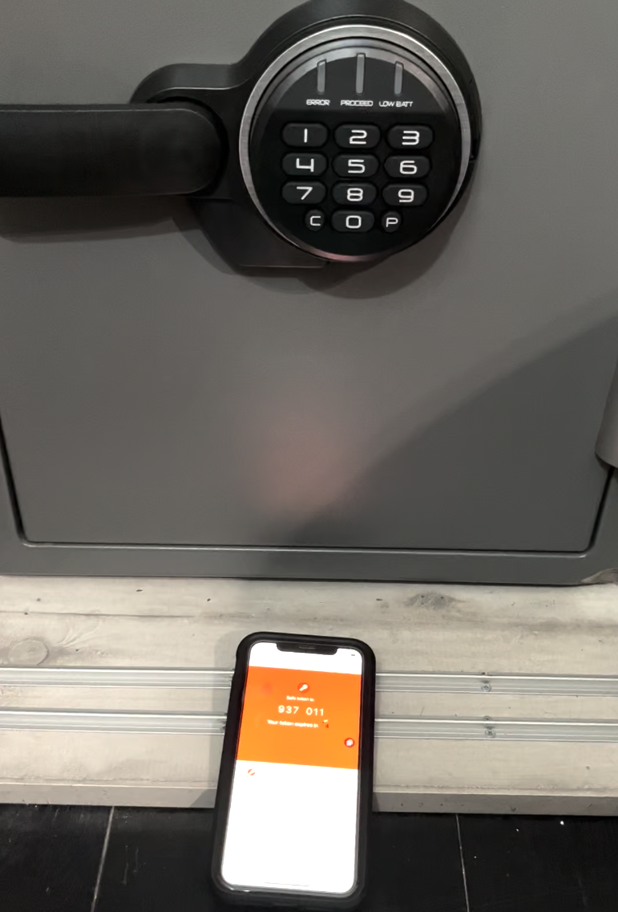

# How to fix a safe

A vulnerability allow to open electronic safes from Sentry Safe and Master Lock without any pin code.

This repository contain alternative PCB and firmware to patch this issue.

For more detail about the vulnerability, [check this repo](https://github.com/H4ckd4ddy/bypass-sentry-safe)

### PCB

| Version | Design                                                | Description                                 |
| :-----: | :---------------------------------------------------: | :------------------------------------------ |
| v1.0    |  | Only ATmega328, basic offline features      |
| v2.0    |  | With esp8266, OTP or remote control support |

### Firmware

⚠️ This is only a PoC for the moment ⚠️

4 modes :

- Static code
- OTP
- Static code OR OTP
- Static code AND OTP

### Setup

- Get PCB
- Solder components
- Flash firmware
- Plug it inside safe door, in place of original board
- Enjoy

### Pictures

